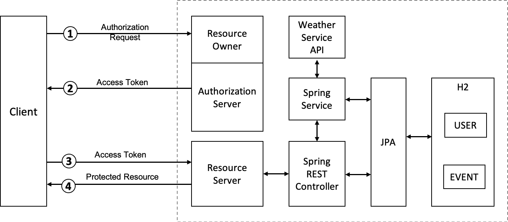
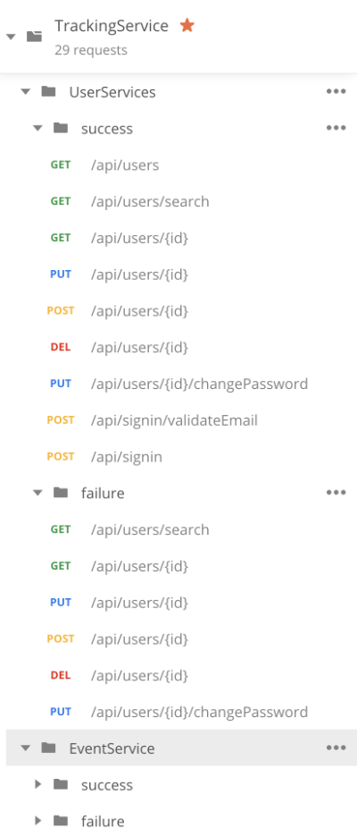

# Jogging Tracking API
The objective is to build a Jogging Tracking API based application.  

## High Level Design
Here is the high level design diagram of API implementation. The application is being based on Java Spring Boot and H2 as Database.
The Spring boot application also contains the OAuth Server. Spring JPA has been used along with rsql.    

## API Endpoints:
- [POST] `/api/signin`:
    - Used for registering user to the application. This is open to any user.
- [POST] `/api/signin/validateEmail`:
    - Used for validating an existing using email id. This also can be accessed by any user.
- [GET] `/api/users`:
    - Lists all the current uses for USER_MANAGER role. USER role will only find him/her self. 
- [GET] `/api/users/search`:
    - User can be reached using email address. USER role does not have access.
- [GET] `/api/users/{id}`:
    - Retrieve User details. USER role can only retrieve his/her profile.
- [PUT] `/api/users/{id}`:
    - Update User details. USER role can only update his/her profile.
- [POST] `/api/users/{id}`:
    - Create new user. USER role does not have access.
- [DELETE] `/api/users/{id}`:
    - Delete existing user. USER role can only delete his/her profile.
- [GET] `/api/event`:
    - Lists all the current events for any user. USER role can only view him/her events. USER_MANAGER role does not have access.
- [GET] `/api/event/find`:
    - Search for events using filter operations. USER role can only view him/her events. USER_MANAGER role does not have access.
    - Here are some sample queries:
        - /api/event/find?search=distance>800 and weatherCondition==sunny
        - /api/event/find?search= ( distance<=3.0 and distance >100 ) and date==2008-11-04
        - /api/event/find?search=(distance>800 or distance < 400) and weatherCondition==sunny&sort=distance,desc
- [GET] `/api/event/{id}`:
    - Retrieve event details. USER role can only retrieve his/her events.
- [PUT] `/api/event/{id}`:
    - Update event details. USER role can only Update his/her events.
- [POST] `/api/event/{id}`:
    - Create new event. USER role can create event for his/her self.
- [DELETE] `/api/event/{id}`:
    - Delete existing event. USER role can only Delete his/her events.
- [GET] `/api/event/{id}`:
    - Retrieve User details. USER role can only retrieve his/her events.
- [GET] `/api/event/report`:
    - Create weekly report with speed and average distance per user. USER role can only view him/her events. USER_MANAGER role does not have access.
    
## Automated Testing

### Unit Testing
- Unit Testing has been accomplished using `junit`, `mockito` and Spring Boot Test packages. 
### End-to-End Testing:
-  Postman scripts have been used along with JSON Schema for Automated E2E Testing. Both positive and negative scenario based test case has been added.   
    - The postman collection was exported and saved under the following path in the demoservice project.
        - http://localhost:8008/TrackingService.postman_collection.json
    - The above script points to different schemas required for validation during integration testing. Below is the list of schemas used:
        - http://localhost:8008/apierror.json
        - http://localhost:8008/event.json
        - http://localhost:8008/getUser.json
        - http://localhost:8008/listevent.json
        - http://localhost:8008/listUsers.json
        - http://localhost:8008/report.json
    - If needed the postman script can be executed from CLI, in case CI/CD pipeline is used.
    - The Postman collection has folders for each entity and them under them success and failure test cases.
      
    
        
        

    
